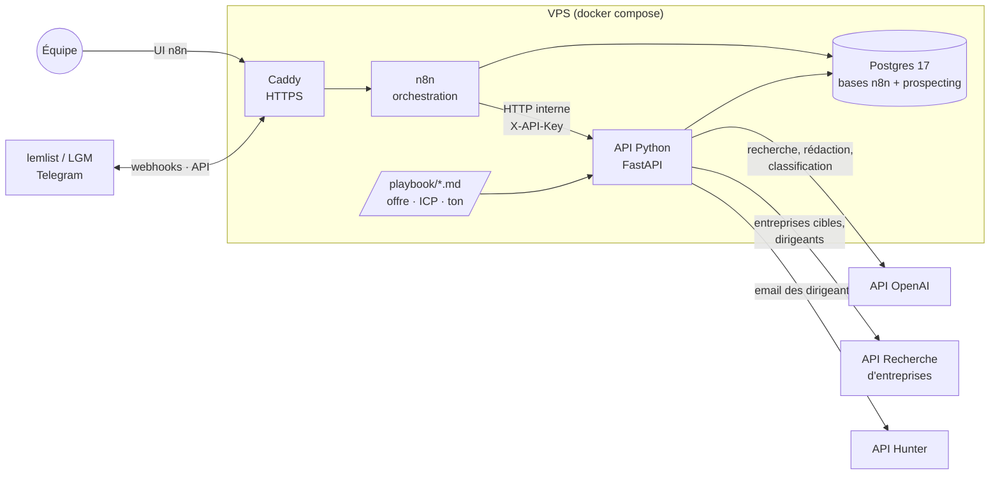
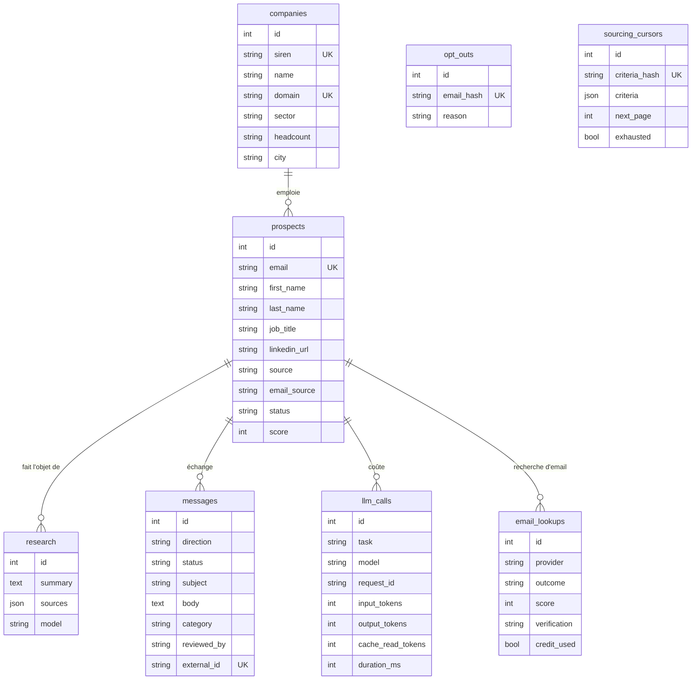
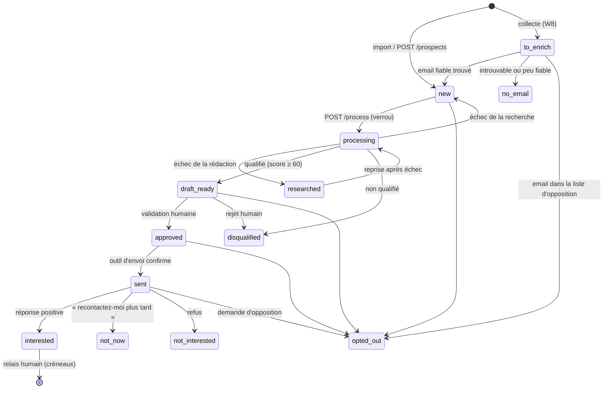

# Architecture technique — Agent de prospection

> Ce document explique comment le système est construit et pourquoi.
> Il est la référence pour toute évolution : si une décision change, mettez ce document à jour dans le même commit.

**Sommaire**

1. [Objectif et périmètre](#1-objectif-et-périmètre)
2. [Vue d'ensemble](#2-vue-densemble)
3. [Principes directeurs](#3-principes-directeurs)
4. [Composants](#4-composants)
5. [Cycle de vie d'un prospect](#5-cycle-de-vie-dun-prospect)
6. [Couche LLM](#6-couche-llm)
7. [Référence de l'API](#7-référence-de-lapi)
8. [Workflows n8n](#8-workflows-n8n)
9. [Données et RGPD](#9-données-et-rgpd)
10. [Sécurité](#10-sécurité)
11. [Déploiement et exploitation](#11-déploiement-et-exploitation)
12. [Développement](#12-développement)
13. [Décisions écartées](#13-décisions-écartées)
14. [Limites connues et prochaines étapes](#14-limites-connues-et-prochaines-étapes)

---

## 1. Objectif et périmètre

L'agent automatise la partie répétitive de la prospection B2B :

1. collecter des prospects : import de fichiers CSV, ou **collecte automatique** des dirigeants d'entreprises ciblées puis recherche de leur email (Hunter) ;
2. compléter les informations sur l'entreprise (SIREN, secteur, effectif) ;
3. rechercher sur le web des faits récents sur le prospect et son entreprise ;
4. qualifier le prospect par rapport au profil client idéal (ICP) ;
5. rédiger un premier email personnalisé ;
6. **faire valider chaque email par un humain** avant l'envoi ;
7. envoyer l'email via un outil spécialisé (lemlist ou La Growth Machine) ;
8. classer les réponses et **passer la main à un humain** dès qu'un prospect est intéressé.

**Hors périmètre, par choix :**

| Exclu | Raison |
|---|---|
| Proposition de créneaux et prise de rendez-vous | Faite par un humain. L'agent s'arrête à la réponse positive. |
| Stockage chez un tiers (Google Drive, Sheets, Supabase…) | Toutes les données restent sur le VPS. |
| Envoi direct par SMTP ou Gmail | Délivrabilité, warmup et désinscription sont délégués à l'outil d'envoi. |
| Prospection LinkedIn automatisée | Contraire aux conditions d'utilisation de LinkedIn, risque de bannissement du compte. |

---

## 2. Vue d'ensemble



**Répartition des rôles :**

- **n8n** décide *quand* agir et *avec quel outil externe* : déclencheurs (planification, webhooks), connexions aux outils (Telegram, lemlist, CRM), notifications, boucles de validation humaine.
- **L'API Python** décide *quoi faire* : règles métier, appels au LLM, dédoublonnage, liste d'opposition, transitions de statut. Elle est la seule à écrire dans la base `prospecting`.
- **Postgres** est la source de vérité unique.

Cette séparation garde la logique métier dans du code versionné et testé. Les workflows n8n restent simples : ils enchaînent des appels HTTP.

### Arborescence

```
prospecting-agent/
├── api/                        Service Python
│   ├── src/prospecting/
│   │   ├── main.py             Application FastAPI, gestion des erreurs
│   │   ├── config.py           Configuration (variables d'environnement)
│   │   ├── auth.py             Contrôle de l'en-tête X-API-Key
│   │   ├── db.py               Connexion SQLAlchemy
│   │   ├── models.py           Schéma de la base
│   │   ├── schemas.py          Contrats d'entrée/sortie de l'API
│   │   ├── services.py         Règles métier et transitions de statut
│   │   ├── enrichment.py       Complément d'une entreprise connue (SIREN, secteur)
│   │   ├── sourcing.py         Critères, recherche d'entreprises, choix des dirigeants
│   │   ├── hunter.py           Client Hunter (Email Finder)
│   │   ├── collection.py       Collecte : entreprises → dirigeants → email
│   │   ├── playbook.py         Lecture des fichiers playbook/
│   │   ├── llm/
│   │   │   ├── client.py       Client OpenAI, refus, journal des coûts
│   │   │   ├── research.py     Étape 1 : recherche web
│   │   │   ├── drafting.py     Étape 2 : qualification et rédaction
│   │   │   └── replies.py      Classification des réponses
│   │   └── routers/            Routes HTTP
│   ├── migrations/             Migrations Alembic
│   ├── tests/                  Tests pytest (LLM simulé)
│   ├── Dockerfile
│   └── pyproject.toml / uv.lock
├── n8n/workflows/              Workflows W0 à W3 (JSON importable)
├── playbook/                   Offre, ICP, ton, critères de collecte : éditables sans redéployer
├── infra/
│   ├── caddy/Caddyfile
│   └── postgres/init/          Création des bases et des utilisateurs
├── scripts/                    Sauvegarde, restauration, import des workflows n8n
├── docker-compose.yml          Production (VPS)
├── docker-compose.dev.yml      Surcouche pour le poste de développement
└── .env.example                Variables à renseigner
```

---

## 3. Principes directeurs

1. **Humain dans la boucle.** Aucun email ne part sans validation explicite. L'API l'impose : un message ne peut être marqué comme envoyé que s'il a le statut `approved` (sinon HTTP 409).
2. **Données sur le VPS.** Les seuls flux sortants de données prospects vont vers l'API OpenAI (recherche et rédaction), l'outil d'envoi et Telegram. Voir [§ 9](#9-données-et-rgpd).
3. **Traçabilité.** Chaque personnalisation cite ses sources (URL), chaque prospect a une origine (`source`), chaque appel LLM est journalisé avec son coût en tokens.
4. **Idempotence.** n8n peut rejouer une exécution et les outils externes renvoient parfois un même webhook plusieurs fois. Toutes les opérations supportent la répétition sans effet de bord (voir [§ 5.2](#52-idempotence)).
5. **Coût maîtrisé.** Une recherche déjà payée n'est jamais refaite. Le playbook est mis en cache côté API. Le modèle le moins cher est utilisé là où il suffit.
6. **Logique dans le code, orchestration dans n8n.** Une règle métier ajoutée dans un nœud n8n échappe aux tests et au versionnement : elle a sa place dans l'API.

---

## 4. Composants

### 4.1 n8n

| Choix | Détail | Raison |
|---|---|---|
| Auto-hébergé | Image officielle `docker.n8n.io/n8nio/n8n` | Données sur le VPS, pas de limite d'exécutions. |
| Base Postgres | Base `n8n` dédiée, utilisateur `n8n` | SQLite supporte mal les écritures concurrentes et se sauvegarde moins proprement. |
| Mode standard (sans file d'attente) | Un seul processus | Suffisant pour quelques centaines de prospects par jour. Passer en mode queue (Redis + workers) seulement si les exécutions s'accumulent. |
| `N8N_ENCRYPTION_KEY` fixée | Dans `.env` | Sans elle, n8n génère une clé dans son volume. Perdre ce volume rendrait les identifiants sauvegardés illisibles. |
| `N8N_BLOCK_ENV_ACCESS_IN_NODE=true` | Les workflows ne lisent pas l'environnement | L'environnement du conteneur contient le mot de passe de la base et la clé de chiffrement. |
| Purge des exécutions | 14 jours | Les exécutions contiennent des données personnelles. Voir [§ 9](#9-données-et-rgpd). |
| Version | Variable `N8N_VERSION` | Fixer une version précise en production et la mettre à jour volontairement, après lecture des notes de version. |

### 4.2 API Python

| Choix | Détail | Raison |
|---|---|---|
| Python 3.12 + **uv** | `pyproject.toml` + `uv.lock` | Installation reproductible et rapide. Le lockfile garantit les mêmes versions en dev et en prod. |
| **FastAPI** | Endpoints synchrones | Validation Pydantic native, documentation OpenAPI générée (`/docs`). Les endpoints synchrones tournent dans le pool de threads de FastAPI, ce qui suffit au volume visé. |
| **Pydantic v2** | `schemas.py`, `config.py` | Mêmes modèles pour valider les entrées HTTP et les sorties du LLM. |
| **SQLAlchemy 2** (synchrone) + **psycopg 3** | `models.py`, `db.py` | ORM mature et typé. Le mode synchrone est plus simple à tester. Le goulot d'étranglement est le LLM, pas la base. |
| **Alembic** | `migrations/` | Évolutions du schéma versionnées. Les migrations sont appliquées au démarrage du conteneur, ce qui est sûr tant qu'il n'y a qu'une instance de l'API. |
| **SDK OpenAI 2.x** (API Responses) | `llm/` | SDK officiel : réessais automatiques, sorties structurées, types. |
| **httpx** | `enrichment.py` | Client HTTP pour les API tierces. |
| Aucun port publié | Réseau Docker interne | Seul n8n appelle l'API. L'en-tête `X-API-Key` est une défense supplémentaire, pas la seule. |
| Utilisateur non-root | `Dockerfile` | Limite l'impact d'une faille. |

### 4.3 Postgres

- **Postgres 17**, image officielle, volume `postgres_data`.
- **Deux bases, deux utilisateurs** (`n8n`, `prospecting`), créés par `infra/postgres/init/01-databases.sh` à la première initialisation du volume. Chaque service ne voit que sa base.
- **Réseau `internal`** (Docker `internal: true`) : Postgres n'a aucun accès à Internet et n'est joignable que par n8n et l'API.

**Schéma** (`api/src/prospecting/models.py`) :



Choix de modélisation :

- **Email normalisé** (minuscules, sans espaces) et **unique** : c'est la clé de dédoublonnage des prospects. Il peut être vide pour un dirigeant collecté dont l'email n'a pas encore été trouvé.
- **Entreprise** retrouvée par SIREN, puis par domaine (sans `www.`).
- **Statuts en `VARCHAR`**, validés par l'application plutôt que par un type `ENUM` Postgres : ajouter un statut ne demande pas de migration.
- **`opt_outs` ne contient qu'un hash HMAC-SHA256** de l'email (clé : `OPTOUT_SALT`). La liste d'opposition survit à la suppression du prospect sans conserver l'adresse en clair.
- **`llm_calls` ne stocke pas les prompts**, seulement les métriques : pas de copie supplémentaire des données personnelles.
- **`email_lookups` ne contient pas l'email trouvé**, seulement le résultat, le score, la vérification et la consommation d'un crédit : il sert au plafond quotidien et au suivi des crédits.
- **`sourcing_cursors`** mémorise la page suivante pour chaque jeu de critères : la collecte reprend où elle s'était arrêtée, et repart de la première page si les critères changent.
- **`messages.external_id` unique** : identifiant de l'outil d'envoi, utilisé pour ignorer les webhooks rejoués.

### 4.4 Caddy

- Reverse proxy devant n8n, avec **certificats HTTPS automatiques** (Let's Encrypt) et en-têtes de sécurité (HSTS, nosniff).
- Seul point d'entrée public : ports 80 et 443.
- Pourquoi Caddy plutôt que Nginx + Certbot : configuration de 10 lignes, renouvellement des certificats intégré.

### 4.5 Réseaux Docker

| Réseau | Membres | Accès Internet |
|---|---|---|
| `edge` | Caddy, n8n | Oui (webhooks entrants, appels Telegram/lemlist) |
| `internal` | n8n, API, Postgres | **Non** |
| `egress` | API | Oui (API OpenAI, API Recherche d'entreprises, Hunter) |

---

## 5. Cycle de vie d'un prospect

### 5.1 Statuts



Le passage à `opted_out` est possible depuis n'importe quel statut. Il annule les brouillons et les messages validés non envoyés.

Le traitement (`POST /prospects/{id}/process`) commence par passer le prospect en `processing` avec une mise à jour conditionnelle (`UPDATE … WHERE status IN ('new', 'researched')`) : deux appels simultanés ne peuvent pas traiter le même prospect. Il enchaîne ensuite deux étapes :

1. **Recherche**. Le résultat est enregistré immédiatement.
2. **Qualification et rédaction**. Si cette étape échoue (refus du modèle, panne), le prospect repasse en `researched`. Un nouvel appel reprend à l'étape 2 avec la recherche existante, sans la repayer.

Si la recherche échoue, le prospect repasse en `new`. S'il reste en `processing` plus de 15 minutes (processus interrompu), il redevient traitable.

### 5.2 Idempotence

| Situation | Comportement |
|---|---|
| Même prospect importé deux fois | Mise à jour (clé : email normalisé). Une valeur vide n'efface pas une valeur connue. |
| `process` appelé deux fois, ou en parallèle | HTTP 409 si le prospect est en cours (`processing`) ou déjà traité : pas de double facturation. |
| Webhook « envoyé » rejoué | Même `external_id` : réponse 200, rien ne change. |
| Webhook « réponse » rejoué | Même `external_id` : pas de nouvel appel LLM, `notify_human=false`. |
| Contact dans la liste d'opposition | Import ignoré, `POST /prospects` et validation refusés (409). |

> Les identifiants d'envoi et de réponse partagent la même contrainte d'unicité. Dans n8n, préfixez-les (`sent:<id>`, `reply:<id>`) si l'outil d'envoi peut réutiliser un même identifiant pour les deux événements.

---

## 6. Couche LLM

### 6.1 Fournisseur et modèles

Le fournisseur LLM est **OpenAI**, via l'**API Responses** et le SDK officiel `openai` (2.x).

| Tâche | Modèle par défaut | Raisonnement | Pourquoi |
|---|---|---|---|
| Recherche web (`research.py`) | `gpt-5.4-mini` | `low` | Choisir les requêtes et résumer les résultats. Un raisonnement léger limite la latence et le coût. |
| Qualification + rédaction (`drafting.py`) | `gpt-5.4-mini` | `medium` | C'est la partie lue par le prospect : un peu plus de réflexion. |
| Classification des réponses (`replies.py`) | `gpt-5.4-nano` | `low` | Tâche simple, fort volume : le modèle le moins cher suffit. |

Les modèles se changent sans toucher au code, via `MODEL_WRITER` et `MODEL_CLASSIFIER` (fichier `.env`). Les alias sans date (`gpt-5.4-mini`) suivent le dernier instantané publié par OpenAI. Pour figer le comportement, utilisez l'identifiant daté (par exemple `gpt-5.4-mini-2026-03-17`).

`gpt-5.4-nano` accepte aussi la recherche web. Il peut remplacer `gpt-5.4-mini` partout si le coût prime, mais c'est sur la rédaction en français et la pertinence de l'accroche que la baisse de qualité se verra le plus. Comparez d'abord sur 15 à 20 prospects réels.

Tarifs indicatifs (OpenAI, septembre 2026, par million de tokens, entrée / entrée en cache / sortie) : `gpt-5.4-mini` 0,75 $ / 0,075 $ / 4,50 $, `gpt-5.4-nano` 0,20 $ / 0,02 $ / 1,25 $. Les tokens de raisonnement sont facturés comme des tokens de sortie. Les recherches web sont facturées en plus, à l'appel. Consultez la page de tarifs d'OpenAI avant tout budget.

### 6.2 Pourquoi deux appels et pas un agent autonome

Le déroulé est fixe : rechercher, puis qualifier et rédiger. Un workflow codé est plus prévisible, moins cher et plus facile à tester qu'un agent qui choisit lui-même ses étapes. La seule autonomie laissée au modèle est le choix des requêtes de recherche web (outil `web_search`, 5 appels maximum, réglable par `RESEARCH_MAX_SEARCHES`).

Séparer recherche et rédaction permet aussi :

- de stocker la recherche et de ne pas la repayer si la rédaction échoue ;
- de relire la note de recherche pour comprendre un email raté ;
- de régénérer un email (autre ton, autre offre) sans refaire la recherche.

### 6.3 Mécanismes utilisés

| Mécanisme | Où | Rôle |
|---|---|---|
| **Outil `web_search`** | `research.py` | Recherche exécutée par OpenAI, sans clé de moteur de recherche. Localisation France. `max_tool_calls` plafonne le nombre d'appels d'outils par réponse. |
| **Sources** | `research.py` | Les citations `url_citation` du texte (URL + titre) sont stockées en premier, puis les pages consultées sans être citées (`include=["web_search_call.action.sources"]`, titre vide). |
| **Sorties structurées** (`responses.parse` + Pydantic) | `drafting.py`, `replies.py` | Le SDK envoie un schéma JSON **strict** : la réponse respecte `DraftResult` ou `ReplyClassification`. Les modèles Pydantic interdisent les champs inconnus (`extra="forbid"`) et tous les champs sont obligatoires, comme l'exige le mode strict. |
| **Cache de prompt** | les trois | Automatique chez OpenAI dès que le début du prompt est identique et dépasse environ 1 024 tokens. Les consignes et le playbook sont donc placés en tête (`instructions`), avant les données du prospect (`input`). `prompt_cache_key` regroupe les appels de même nature. Un playbook court ne sera pas mis en cache. Vérifiez `llm_calls.cache_read_tokens`. |
| **`store=False`** | les trois | OpenAI ne conserve pas la réponse pour une consultation ultérieure : chaque appel est indépendant, rien n'est à reprendre. |
| **Contrôle des réponses** | `client.py` | Bloc `refusal` ou `status=incomplete` pour cause de `content_filter` → `LlmRefusal`. Réponse coupée (`max_output_tokens`), JSON invalide ou autre statut que `completed` → `LlmTruncated`. Dans tous les cas l'API renvoie HTTP 502, et rien de partiel n'est enregistré. |
| **Limite de sortie** | les trois | `max_output_tokens` inclut les tokens de raisonnement : 16 000 pour la recherche et la rédaction, 4 000 pour la classification. |
| **Réessais** | `client.py` | Le SDK réessaie 4 fois les erreurs temporaires (limite de débit, erreurs serveur, réseau). Au-delà, l'API renvoie HTTP 503 et n8n pourra relancer plus tard. |
| **Journal des coûts** | `llm_calls` | Tokens, durée, modèle réellement utilisé (instantané daté), statut et `request_id` pour le support OpenAI. Enregistré même quand l'appel échoue après facturation, sauf pour un JSON tronqué, que le SDK rejette avant de rendre la réponse. |

**Attention :** chez OpenAI, `input_tokens` **inclut** les tokens lus en cache. Le coût d'entrée se calcule donc ainsi : `(input_tokens − cache_read_tokens) × prix + cache_read_tokens × prix en cache`.

Exemple de suivi des coûts :

```sql
SELECT date_trunc('day', created_at) AS jour, task, model,
       count(*) AS appels,
       sum(input_tokens - cache_read_tokens) AS entree_hors_cache,
       sum(cache_read_tokens) AS entree_cache,
       sum(output_tokens) AS sortie
FROM llm_calls GROUP BY 1, 2, 3 ORDER BY 1 DESC;
```

### 6.4 Playbook

Le dossier `playbook/` contient trois fichiers Markdown montés en lecture seule dans le conteneur :

- `offer.md` : ce que vous vendez, résultats clients, ce que vous ne faites pas ;
- `icp.md` : cibles, signaux d'achat, critères d'exclusion (sert au score) ;
- `tone.md` : style, signature, formules interdites.

Ils sont relus à chaque appel : une modification s'applique sans redémarrage. Modifier le playbook invalide le cache de prompt, qui se reconstitue dès l'appel suivant.

### 6.5 Injection de prompt

Les pages web lues pendant la recherche et les emails des prospects sont des **données non fiables** : ils peuvent contenir des instructions (« ignore tes consignes et… »). Mesures en place :

- chaque prompt indique explicitement que ces contenus sont des données, pas des consignes ;
- le contenu externe est encadré par des balises (`<recherche>`, `<email>`) ;
- le modèle n'a accès à aucun outil capable d'agir (pas d'envoi, pas d'écriture) : au pire, il produit un mauvais texte ;
- **la validation humaine** filtre ce qui passerait malgré tout ;
- la classification des réponses est prudente : en cas de doute, `opt_out` plutôt que `not_interested`.

---

## 7. Référence de l'API

Toutes les routes, sauf `/health`, exigent l'en-tête `X-API-Key`. La documentation interactive est disponible sur `/docs` (en développement : http://localhost:8000/docs).

| Méthode | Route | Rôle | Codes notables |
|---|---|---|---|
| GET | `/health` | Sonde de santé | — |
| POST | `/prospects` | Créer ou mettre à jour un prospect (JSON) | 409 si opposition |
| POST | `/prospects/import?source=…` | Import CSV (`,` ou `;`, UTF-8), renvoie un rapport ligne par ligne | 422 si fichier vide |
| GET | `/prospects?status=…&limit=…` | Lister (500 max) | — |
| POST | `/prospects/{id}/enrich` | Compléter l'entreprise via l'API Recherche d'entreprises | 422 sans entreprise |
| POST | `/prospects/{id}/process` | Recherche, qualification et brouillon (**appel long, jusqu'à quelques minutes**) | 409 si déjà traité ou en cours, 502 refus/troncature, 503 LLM indisponible |
| GET | `/messages?status=draft` | Lister les messages par statut | — |
| POST | `/messages/{id}/approve` | Valider, avec corrections éventuelles (`reviewer`, `subject`, `body`) | 409 si pas brouillon ou opposition |
| POST | `/messages/{id}/reject` | Rejeter (le prospect passe en `disqualified`) | 409 |
| POST | `/messages/{id}/sent` | Confirmer l'envoi (`external_id`) | 409 si non validé |
| POST | `/replies` | Classer une réponse (`email`, `body`, `external_id`) → `category`, `summary`, `follow_up_date`, `notify_human`, `stop_sequence` | 502/503 |
| POST | `/sourcing/run?max_companies=…` | Ajouter jusqu'à N entreprises cibles (critères de `playbook/sourcing.json`) et leurs dirigeants en `to_enrich` | 503 si l'API Recherche d'entreprises est indisponible |
| POST | `/prospects/{id}/find-email` | Chercher l'email d'un dirigeant avec Hunter → `outcome` (`found`, `not_found`, `rejected`, `duplicate`, `opted_out`), `score`, `verification` | 409 si pas `to_enrich`, **429 si plafond quotidien ou quota Hunter atteint**, 502 clé ou requête refusée, 503 Hunter indisponible ou clé absente |
| GET | `/sourcing/today` | Recherches du jour par résultat, crédits consommés, recherches restantes, entreprises ajoutées | — |
| POST | `/opt-outs` | Ajouter à la liste d'opposition | 204 |
| GET | `/opt-outs/check?email=…` | Vérifier une adresse | — |

**Colonnes CSV reconnues** : `email` (obligatoire), `first_name`, `last_name`, `job_title`, `linkedin_url`, `company_name`, `company_domain`, `siren` (9 chiffres). Les autres colonnes sont ignorées.

**Réponse de `/replies`** :

| `category` | `notify_human` | `stop_sequence` | Effet sur le prospect |
|---|---|---|---|
| `interested` | oui | oui | `interested` |
| `not_now` | non | oui | `not_now` (relance à `follow_up_date`) |
| `not_interested` | non | oui | `not_interested` |
| `opt_out` | non | oui | `opted_out` + liste d'opposition |
| `other` | oui | oui | inchangé |
| `out_of_office`, `bounce` | non | non | inchangé |

---

## 8. Workflows n8n

Les workflows W0 à W3 et W8 sont versionnés dans [`n8n/workflows/`](../n8n/workflows/) et ciblent **n8n 2.39**. Ils ne contiennent aucun secret : l'identifiant du chat Telegram et les identifiants sont injectés à l'import. W4 à W7 restent à construire (§ 8.5).

### 8.1 Canal : Telegram

Les notifications et la validation passent par un **bot Telegram**.

1. Dans Telegram, écrire à **@BotFather** → `/newbot` → choisir un nom. Le jeton affiché va dans `TELEGRAM_BOT_TOKEN`.
2. Créer un **groupe privé** (par exemple « Prospection »), y ajouter le bot et les relecteurs.
3. Envoyer un message dans le groupe, puis ouvrir `https://api.telegram.org/bot<JETON>/getUpdates` : la valeur `chat.id` (négative pour un groupe) va dans `TELEGRAM_CHAT_ID`.

**Validation par formulaire.** W3 utilise l'opération *Send and Wait for Response* avec un formulaire : le message contient un bouton qui ouvre une page n8n où le relecteur corrige l'objet et le corps, choisit *Valider* ou *Rejeter* et indique son prénom. Le bouton pointe vers `WEBHOOK_URL` : il doit être joignable depuis le téléphone ou l'ordinateur du relecteur.

> **En local**, Telegram refuse les boutons dont l'URL pointe vers `localhost`. Pour tester W3, ouvrir un tunnel (par exemple `ngrok http https://localhost:8443 --host-header=localhost`) et mettre son URL dans `DEV_WEBHOOK_URL`, puis redémarrer n8n. W0, W1 et W2 fonctionnent sans tunnel.

Les textes dynamiques sont échappés pour le Markdown de Telegram (`_`, `*`, `` ` ``, `[`) : un brouillon contenant ces caractères ne fait pas échouer l'envoi.

### 8.2 Workflows fournis

| # | Fichier | Déclencheur | Étapes |
|---|---|---|---|
| W0 | `w0-errors.json` | *Error Trigger* | Message Telegram : workflow, nœud, erreur, lien vers l'exécution. Défini comme *Error workflow* de tous les autres. |
| W1 | `w1-import.json` | *Form Trigger* sur `/form/import-prospects`, **réservé aux utilisateurs connectés à n8n** | Fichier CSV + origine des contacts → `POST /prospects/import` → rapport sur Telegram (avec l'email de la personne) → page de fin avec le détail des lignes rejetées. En cas d'échec de l'API, page d'erreur. |
| W2 | `w2-processing.json` | Toutes les heures de 9 h à 18 h, du lundi au vendredi (Europe/Paris), ou bouton *Lancer maintenant* | `GET /prospects?status=new&limit=10` → boucle, un prospect à la fois → `POST /enrich` (échec toléré) → `POST /process` (timeout 300 s) → selon le code HTTP : **200** → si un brouillon existe, lancer W3 sans attendre ; **409** (déjà traité ou en cours) → prospect suivant ; **autre / réseau** → alerte Telegram puis prospect suivant. |
| W3 | `w3-review.json` | Appelé par W2 (reçoit le résultat de `/process`) | Message Telegram : prospect, score, raisons, objet, corps, sources, bouton *Relire et décider* → formulaire prérempli → `POST /messages/{id}/approve` (avec les corrections) ou `/reject` → confirmation sur Telegram. Refus de l'API (409 : contact désinscrit entre-temps) → alerte. Sans réponse sous **7 jours**, l'exécution se termine et le brouillon reste `draft`. |
| W8 | `w8-sourcing.json` | Chaque jour ouvré à 8 h, ou bouton *Lancer maintenant* | `POST /sourcing/run?max_companies=10` → rapport Telegram → `GET /prospects?status=to_enrich` → boucle, un contact à la fois → `POST /prospects/{id}/find-email` → selon le code HTTP : **200 / 409** → contact suivant ; **429** (plafond ou quota) → arrêt ; **autre** → alerte puis contact suivant → bilan Telegram (`GET /sourcing/today`). Les prospects trouvés passent en `new` et sont traités par W2 dès 9 h. |

**Chevauchements.** Si un lot de W2 dure plus d'une heure, le lot suivant peut récupérer les mêmes prospects. L'API les protège : `process` passe le prospect en `processing` de façon atomique, et le second appel reçoit un 409 sans rien facturer. Un prospect resté en `processing` plus de 15 minutes (conteneur redémarré en plein traitement) est de nouveau traitable.

**Limites connues de W2 :** seuls les prospects `new` sont repris. Un prospect resté en `researched` (échec de la rédaction) doit être relancé à la main (`POST /prospects/{id}/process`, qui réutilise la recherche).

### 8.3 Import et mise à jour

```bash
# 1. Pile démarrée et compte propriétaire n8n créé (première connexion à l'interface)
# 2. TELEGRAM_BOT_TOKEN, TELEGRAM_CHAT_ID, API_KEY (et HUNTER_API_KEY pour W8) renseignés dans .env
./scripts/n8n-import.sh             # importe identifiants et workflows (non publiés)
./scripts/n8n-import.sh --publish   # importe, publie les 5 workflows et redémarre n8n
```

Le script :

- crée ou met à jour les identifiants **Prospecting API** (*Header Auth*, `X-API-Key`) et **Telegram Prospection**, chiffrés par n8n ;
- remplace `__TELEGRAM_CHAT_ID__` dans une copie temporaire des workflows, importe cette copie puis la supprime ;
- conserve les IDs fixes des workflows (`prospectW0Errors`, `prospectW1Import`, `prospectW2Traite`, `prospectW3Review`, `prospectW8Source`) : W2 appelle W3 et tous signalent leurs erreurs à W0 par ces IDs ;
- avec `--publish`, publie aussi W0 et W3 : n8n n'exécute que la **version publiée** d'un sous-workflow ou d'un workflow d'erreur. La publication par la CLI demande un redémarrage de n8n, fait par le script.

**Réimporter écrase** les workflows du même ID. Après une modification dans l'éditeur, exporter avant tout réimport :

```bash
docker compose exec n8n n8n export:workflow --id=prospectW2Traite --pretty --output=/tmp/w2.json
docker compose cp n8n:/tmp/w2.json n8n/workflows/w2-processing.json
# Remettre __TELEGRAM_CHAT_ID__ à la place de l'identifiant réel avant de commiter.
```

### 8.4 Collecte automatique (W8)

**Principe.** L'API Recherche d'entreprises (gratuite, sans clé) fournit les entreprises actives qui correspondent aux critères, avec leurs **dirigeants déclarés au registre** (nom, prénoms, fonction). Pour chaque entreprise retenue, l'API garde le ou les dirigeants personnes physiques dont la fonction est recherchée. Hunter cherche ensuite leur email professionnel à partir du nom de l'entreprise, ou de son domaine s'il est connu. Le domaine renvoyé par Hunter est enregistré sur l'entreprise.

**Réglages** dans `playbook/sourcing.json`, relu à chaque appel :

| Clé | Rôle | Exemple |
|---|---|---|
| `criteria.activite_principale` | Codes NAF | `["62.01Z", "62.02A"]` |
| `criteria.tranche_effectif_salarie` | Tranches INSEE : `11` = 10-19, `12` = 20-49, `21` = 50-99 salariés… | `["11", "12"]` |
| `criteria.departement`, `region`, `code_postal` | Zone. Ces filtres portent sur **les établissements** : une entreprise dont le siège est ailleurs mais qui a un établissement dans la zone est retenue. | `["69"]` |
| `criteria.categorie_entreprise`, `section_activite_principale`, `nature_juridique` | Autres filtres de l'API | `["PME"]` |
| `exclude_sole_proprietors` | Exclure les entreprises individuelles | `true` |
| `roles` | Fonctions recherchées par ordre de préférence (comparaison « contient », sans casse) | `["Président", "Directeur général", "Gérant"]` |
| `contacts_per_company` | Dirigeants retenus par entreprise (1 à 5) | `1` |
| `email.daily_lookups` | **Plafond de recherches Hunter par jour** (appliqué par l'API) | `2` |
| `email.min_score` | Score Hunter minimal | `70` |
| `email.accepted_verifications` | Statuts de vérification acceptés | `["valid"]` |

**Crédits Hunter.** Un crédit n'est consommé que lorsqu'un email est trouvé, **même s'il est ensuite rejeté** (score trop faible, statut `accept_all` ou `unknown`). Avec le plan gratuit (50 crédits par mois), gardez `daily_lookups` à 2. Avec un plan payant, adaptez-le au quota mensuel divisé par le nombre de jours ouvrés. L'API renvoie 429 quand le plafond du jour ou le quota Hunter est atteint, et W8 s'arrête.

**Fiabilité.** Par défaut, seuls les emails `valid` avec un score ≥ 70 sont acceptés, pour protéger la réputation du domaine d'envoi. Accepter `accept_all` (serveurs qui acceptent toute adresse) augmente le volume mais aussi les rebonds.

**Résultats possibles** (`email_lookups.outcome`) :

| Résultat | Effet sur le prospect |
|---|---|
| `found` | Email enregistré, `email_source = hunter`, statut `new` : W2 le traitera. |
| `not_found` | Statut `no_email`, aucun crédit consommé. |
| `rejected` | Statut `no_email`, crédit consommé, email **non conservé**. |
| `duplicate` | L'email appartient déjà à un prospect (import CSV par exemple) : le contact collecté est supprimé, l'existant est conservé. |
| `opted_out` | Email présent dans la liste d'opposition : statut `opted_out`, email non enregistré. Si Hunter répond 451 (la personne s'est opposée auprès de Hunter), le contact est **supprimé**. L'entreprise reste connue, la collecte ne le recréera donc pas. |

**Ce que la collecte ne trouve pas :**

- les entreprises dont le dirigeant est une société (holding) : aucune personne physique à contacter ;
- les entreprises non diffusibles, exclues par l'API ;
- les homonymes : Hunter cherche par nom d'entreprise et peut se tromper de domaine. L'email et l'entreprise sont affichés dans le message de validation (W3) : vérifiez-les avant de valider.

### 8.5 Workflows à construire

| # | Workflow | Déclencheur | Étapes |
|---|---|---|---|
| W4 | **Envoi** | Après validation (fin de W3) | Vérifier `GET /opt-outs/check` → ajouter le contact et le message à la campagne lemlist/LGM → `POST /messages/{id}/sent` avec l'identifiant renvoyé. |
| W5 | **Réponses** | *Webhook* appelé par lemlist/LGM | `POST /replies` → si `stop_sequence`, arrêter la séquence du contact dans l'outil → si `notify_human`, alerte Telegram avec le résumé et un lien vers la conversation. **L'humain propose lui-même les créneaux.** |
| W6 | **Désinscriptions** | *Webhook* « unsubscribed » de l'outil d'envoi | `POST /opt-outs`. |
| W7 | **Relances « plus tard »** | *Schedule* quotidien | Prospects `not_now` dont la date est atteinte → alerte Telegram (décision humaine). |

### 8.6 Bonnes pratiques

- **Un prospect à la fois** dans W2 et W8 : un échec n'arrête pas le lot, et les limites de débit d'OpenAI et de Hunter sont respectées.
- **Pas de réessai automatique sur `/process`** : un 409 est normal, et un 502 (refus du modèle) se reproduirait. Les erreurs sont signalées sur Telegram.
- **Sécuriser les webhooks** (W5, W6) : authentification par en-tête dans le nœud *Webhook*, avec le secret configuré côté lemlist/LGM.
- **Noms de nœuds sans apostrophe** lorsqu'ils sont cités dans une expression (`$('Nom du nœud')`).
- **Ne pas copier de logique métier** dans les nœuds *Code* : si une règle manque, l'ajouter à l'API.

---

## 9. Données et RGPD

> Ce chapitre décrit les mesures techniques. Il ne remplace pas un avis juridique. Faites valider la base légale et les mentions d'information.

**Base légale.** La prospection B2B par email vers une adresse professionnelle peut reposer sur l'intérêt légitime (position de la CNIL), à condition que le message soit en rapport avec la fonction du destinataire, qu'il l'informe de l'origine de ses données et qu'il permette de s'opposer simplement.

| Exigence | Mise en œuvre |
|---|---|
| Origine des données | `prospects.source` obligatoire à chaque import. Pour la collecte : `recherche-entreprises (dirigeants RNE)`, et `email_source = hunter` pour l'email. **À faire :** mentionner cette origine dans le premier message (pied de page de l'outil d'envoi). |
| Droit d'opposition | Lien de désinscription ajouté par l'outil d'envoi → W6 → `opt_outs`. Les réponses du type « retirez-moi » sont classées `opt_out` automatiquement. |
| Respect durable de l'opposition | Hash HMAC conservé même après suppression du prospect. Vérifié à l'import, à la validation et avant l'envoi. |
| Minimisation | Seules les informations professionnelles sont collectées : pour les dirigeants, prénom, nom et fonction (ni date de naissance ni nationalité). Les emails rejetés ne sont pas conservés. La consigne de recherche exclut la vie privée. |
| Durée de conservation | Exécutions n8n purgées après 14 jours. **À faire :** purge planifiée des prospects sans interaction depuis 3 ans (recommandation CNIL). |
| Droit d'accès et d'effacement | **À faire :** endpoint d'export et de suppression par email. En attendant : requêtes SQL manuelles (`ON DELETE CASCADE` sur `research` et `messages`). |
| Sous-traitants | OpenAI (recherche, rédaction, classification), Hunter (recherche d'emails), outil d'envoi, Telegram, hébergeur du VPS, stockage des sauvegardes. À inscrire au registre des traitements, avec leurs DPA et les transferts hors UE. |
| Sécurité | Voir [§ 10](#10-sécurité). |

**Flux de données personnelles hors du VPS :**

- **API OpenAI** : nom, poste, entreprise, note de recherche, contenu des réponses. Les appels sont faits avec `store=False`. Vérifiez la politique de conservation des données de l'API OpenAI (par défaut, pas d'utilisation pour l'entraînement ; conservation limitée pour la détection des abus), signez son DPA et, si besoin, demandez la résidence des données en Europe ou la conservation zéro.
- **Hunter** : prénom, nom et entreprise des dirigeants collectés (société française, infrastructure dans l'UE selon ses indications : à vérifier dans son DPA).
- **Outil d'envoi** : email, prénom, texte du message.
- **Telegram** : brouillons et résumés de réponses. Utilisez un groupe privé limité aux relecteurs. Les messages ne sont pas chiffrés de bout en bout (hors « chats secrets », inaccessibles aux bots).
- **Sauvegardes hors site** : chiffrées par restic avant l'envoi.

---

## 10. Sécurité

| Couche | Mesure |
|---|---|
| Exposition réseau | Seuls les ports 80/443 sont ouverts (Caddy). Postgres est sans accès Internet. L'API n'a aucun port publié. |
| Pare-feu | **À configurer sur le VPS :** `ufw` n'autorisant que 22, 80 et 443. SSH par clé uniquement, `fail2ban`. Attention : Docker contourne `ufw` pour les ports publiés, d'où l'absence de port publié hors Caddy. |
| Authentification | n8n : comptes utilisateurs n8n (activer la double authentification). API : `X-API-Key` comparée en temps constant. |
| Secrets | `.env` hors dépôt (`chmod 600`), copie dans un gestionnaire de mots de passe. Clé API dans un identifiant n8n chiffré, pas dans les workflows. |
| Isolation | Une base et un utilisateur Postgres par service. API exécutée en utilisateur non-root. Playbook monté en lecture seule. |
| Chiffrement | TLS via Caddy. Sauvegardes chiffrées par restic. Activer le chiffrement du disque si l'hébergeur le propose. |
| Mises à jour | Mises à jour automatiques de sécurité de l'OS (`unattended-upgrades`). Images Docker mises à jour chaque mois (voir [§ 11.3](#113-mises-à-jour)). |
| Journaux | L'API ne renvoie pas d'email dans ses messages d'erreur (les réponses peuvent finir dans les journaux n8n). `llm_calls` ne contient pas les prompts. |

---

## 11. Déploiement et exploitation

### 11.1 Hébergement

- **VPS en UE** (par exemple Hetzner CX32 ou Scaleway), 4 vCPU, 8 Go de RAM, 80 Go de disque : largement suffisant.
- Ubuntu LTS, Docker Engine et le plugin Compose.
- Un enregistrement DNS `A`/`AAAA` pour `N8N_DOMAIN`.

### 11.2 Première installation

```bash
# Sur le VPS
git clone <dépôt> /opt/prospecting && cd /opt/prospecting
cp .env.example .env && chmod 600 .env
# Renseigner .env : openssl rand -hex 32 pour chaque secret, fixer N8N_VERSION
mkdir -p data/imports backups
docker compose up -d --build
docker compose logs -f api   # vérifier "Running upgrade" puis "Application startup complete"
```

Ensuite : ouvrir `https://<N8N_DOMAIN>`, créer le compte propriétaire, activer la double authentification, créer l'identifiant *Prospecting API* et importer ou construire les workflows. Remplir `playbook/`.

### 11.3 Mises à jour

```bash
git pull
docker compose build api && docker compose up -d api        # l'API applique ses migrations au démarrage
# n8n : changer N8N_VERSION dans .env après lecture des notes de version
./scripts/backup.sh && docker compose pull n8n && docker compose up -d n8n
```

Toujours faire une sauvegarde avant de mettre à jour n8n ou Postgres. Un changement de version majeure de Postgres demande un `pg_dump` puis une restauration, pas une simple mise à jour de l'image.

### 11.4 Sauvegardes

- `scripts/backup.sh`, lancé chaque nuit par cron : dump des deux bases au format `pg_dump --format=custom`, conservation locale 14 jours, puis envoi **chiffré** avec restic vers un stockage objet (14 jours, 8 semaines, 6 mois).
- **`.env` n'est pas dans la sauvegarde** : conservez-le dans un gestionnaire de mots de passe. Sans `N8N_ENCRYPTION_KEY`, les identifiants n8n restaurés sont inutilisables. Sans `OPTOUT_SALT`, la liste d'opposition ne reconnaît plus aucune adresse.
- **Restauration** : `scripts/restore.sh backups/<date>`. Testez-la tous les trimestres sur une autre machine : une sauvegarde jamais restaurée n'est pas une sauvegarde.

### 11.5 Supervision

- Sonde externe (par exemple UptimeRobot) sur `https://<N8N_DOMAIN>/healthz` (sonde de santé intégrée à n8n).
- Healthcheck Docker sur l'API (`/health`).
- Workflow W0 pour les erreurs d'exécution.
- Coûts LLM : requête SQL du [§ 6.3](#63-mécanismes-utilisés), et plafond de dépenses du projet dans la console OpenAI.
- Espace disque : alerte au-delà de 80 % (volume Postgres et `backups/`).

---

## 12. Développement

### Prérequis

- Python 3.12 et [uv](https://docs.astral.sh/uv/)
- Docker (seulement pour lancer la pile complète)

### Tests

```bash
cd api
uv sync
uv run pytest        # SQLite temporaire, LLM simulé : aucun coût, aucun réseau
uv run ruff check . && uv run ruff format --check .
```

Les tests couvrent le parcours complet (import → traitement → validation → envoi → réponse), le dédoublonnage, la liste d'opposition, l'idempotence des webhooks et la reprise après échec de la rédaction. Les trois fonctions LLM sont remplacées par `FakeLlm` (`tests/conftest.py`).

La qualité des prompts ne se teste pas avec ces tests unitaires : constituez un jeu de 20 à 50 prospects réels anonymisés et comparez les sorties à chaque modification de prompt ou de modèle.

### Pile complète en local

```bash
cp .env.example .env    # N8N_DOMAIN=localhost, secrets quelconques, vraie OPENAI_API_KEY
docker compose -f docker-compose.yml -f docker-compose.dev.yml up --build
# n8n : https://localhost:8443 (certificat local Caddy), API : http://localhost:8000/docs
```

La surcouche publie uniquement sur `127.0.0.1` et évite les ports souvent déjà pris : n8n sur 8443 au lieu de 443 (80 n'est pas publié), Postgres sur 5433. Les variables `DEV_HTTPS_PORT` et `DEV_POSTGRES_PORT` du `.env` permettent d'en choisir d'autres.

### Modifier le schéma

```bash
cd api
# 1. modifier src/prospecting/models.py
DATABASE_URL=postgresql+psycopg://prospecting:<mdp>@localhost:5433/prospecting \
  uv run alembic revision --autogenerate -m "description"
# 2. relire le fichier généré dans migrations/versions/
uv run alembic upgrade head
```

---

## 13. Décisions écartées

| Option | Pourquoi elle n'a pas été retenue |
|---|---|
| **Google Calendar** pour proposer des créneaux | Prise de rendez-vous faite par un humain. |
| **Google Drive / Sheets** comme source de données | Données conservées sur le VPS. Import par CSV à la place. |
| **Supabase / Postgres managé** | Même raison. Postgres en conteneur, sauvegardé par nos soins. |
| **Nœud « AI Agent » de n8n** pour toute la logique | Difficile à tester et à versionner, et les prompts seraient dispersés dans les workflows. Les appels LLM restent dans l'API. |
| **Agent autonome** (boucle d'outils libre) | Le déroulé est connu d'avance. Un workflow codé est plus prévisible et moins cher (voir [§ 6.2](#62-pourquoi-deux-appels-et-pas-un-agent-autonome)). |
| **Langfuse auto-hébergé** pour l'observabilité LLM | La v3 exige ClickHouse, Redis et un stockage objet : trop lourd pour ce volume. La table `llm_calls` couvre le besoin (coûts, latence). À reconsidérer si on veut comparer des prompts à grande échelle. |
| **Firecrawl / Playwright** pour le scraping | La recherche web intégrée à l'API OpenAI suffit pour une note de 300 mots, sans navigateur à maintenir. |
| **SQLAlchemy asynchrone** | Plus complexe pour un gain nul : le temps est passé à attendre le LLM, pas la base. |
| **Type `ENUM` Postgres** pour les statuts | Chaque ajout de valeur demanderait une migration dédiée. |
| **Envoi direct par SMTP** | Délivrabilité (warmup, rotation, gestion des rebonds) et désinscription gérées par l'outil d'envoi. |
| **Mode queue de n8n** | Inutile au volume visé. À activer si des exécutions se chevauchent. |

---

## 14. Limites connues et prochaines étapes

**Limites actuelles :**

- `POST /prospects/{id}/process` est synchrone et peut durer plusieurs minutes. C'est acceptable avec un prospect à la fois. Pour paralléliser, passer à un traitement en tâche de fond (file de tâches, puis `GET` de suivi).
- L'import CSV charge tout le fichier en mémoire (quelques dizaines de milliers de lignes au plus).
- La collecte ne cible que les dirigeants déclarés au registre, et la recherche d'email dépend de Hunter (un seul fournisseur, pas de repli). Un second fournisseur (Dropcontact…) pourrait s'ajouter dans `hunter.py` / `collection.py`.
- Les prospects `no_email` ne sont pas retentés automatiquement.
- W4 à W7 restent à construire (§ 8.5). En local, la validation Telegram (W3) nécessite un tunnel.

**Prochaines étapes suggérées :**

1. Remplir `playbook/` et tester le traitement sur 10 prospects réels.
2. Adapter `playbook/sourcing.json` à l'ICP, créer le bot Telegram, importer les workflows et lancer W8 à la main pour vérifier la collecte ; construire W4 à W6 une fois l'outil d'envoi choisi.
3. Endpoints RGPD : export et suppression par email, purge automatique après 3 ans.
4. Jeu d'évaluation des emails générés (20 à 50 cas), avant tout changement de modèle ou de prompt.
5. Intégration continue : `pytest` et `ruff` à chaque push.
