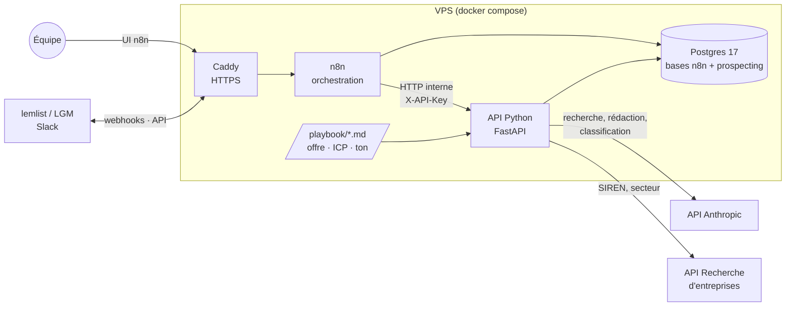
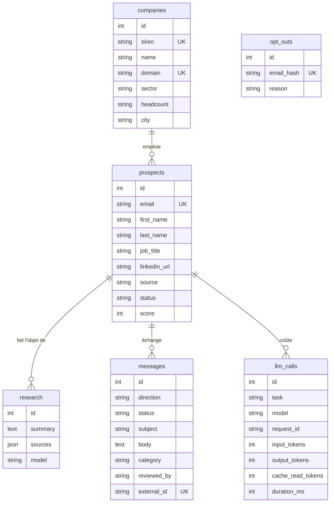
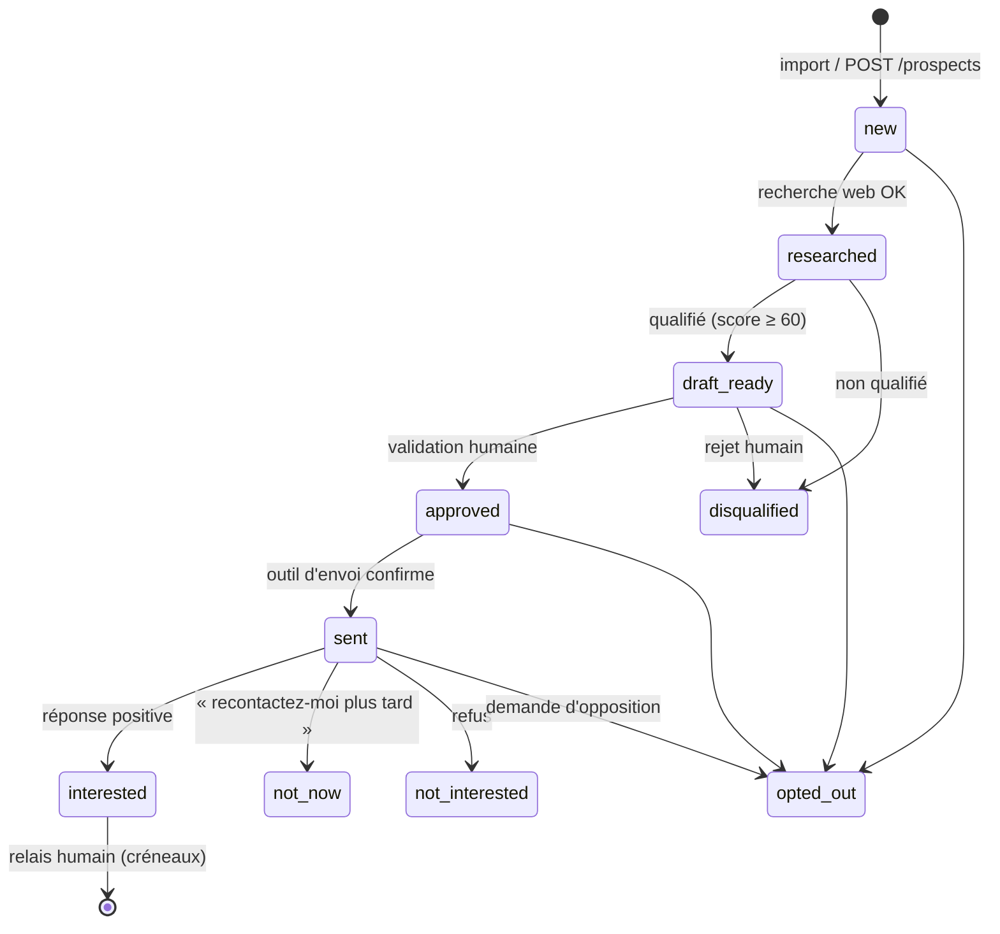

# Architecture technique — Agent de prospection

> Ce document explique comment le système est construit et pourquoi.
> Il est la référence pour toute évolution : si une décision change, mettez ce document à jour dans le même commit.

**Sommaire**

1. [Objectif et périmètre](#1-objectif-et-périmètre)
2. [Vue d'ensemble](#2-vue-densemble)
3. [Principes directeurs](#3-principes-directeurs)
4. [Composants](#4-composants)
5. [Cycle de vie d'un prospect](#5-cycle-de-vie-dun-prospect)
6. [Couche LLM](#6-couche-llm)
7. [Référence de l'API](#7-référence-de-lapi)
8. [Workflows n8n](#8-workflows-n8n)
9. [Données et RGPD](#9-données-et-rgpd)
10. [Sécurité](#10-sécurité)
11. [Déploiement et exploitation](#11-déploiement-et-exploitation)
12. [Développement](#12-développement)
13. [Décisions écartées](#13-décisions-écartées)
14. [Limites connues et prochaines étapes](#14-limites-connues-et-prochaines-étapes)

---

## 1. Objectif et périmètre

L'agent automatise la partie répétitive de la prospection B2B :

1. importer des prospects (fichiers CSV, formulaire, CRM) ;
2. compléter les informations sur l'entreprise (SIREN, secteur, effectif) ;
3. rechercher sur le web des faits récents sur le prospect et son entreprise ;
4. qualifier le prospect par rapport au profil client idéal (ICP) ;
5. rédiger un premier email personnalisé ;
6. **faire valider chaque email par un humain** avant l'envoi ;
7. envoyer l'email via un outil spécialisé (lemlist ou La Growth Machine) ;
8. classer les réponses et **passer la main à un humain** dès qu'un prospect est intéressé.

**Hors périmètre, par choix :**

| Exclu | Raison |
|---|---|
| Proposition de créneaux et prise de rendez-vous | Faite par un humain. L'agent s'arrête à la réponse positive. |
| Stockage chez un tiers (Google Drive, Sheets, Supabase…) | Toutes les données restent sur le VPS. |
| Envoi direct par SMTP ou Gmail | Délivrabilité, warmup et désinscription sont délégués à l'outil d'envoi. |
| Prospection LinkedIn automatisée | Contraire aux conditions d'utilisation de LinkedIn, risque de bannissement du compte. |

---

## 2. Vue d'ensemble



**Répartition des rôles :**

- **n8n** décide *quand* agir et *avec quel outil externe* : déclencheurs (planification, webhooks), connexions aux outils (Slack, lemlist, CRM), notifications, boucles de validation humaine.
- **L'API Python** décide *quoi faire* : règles métier, appels au LLM, dédoublonnage, liste d'opposition, transitions de statut. Elle est la seule à écrire dans la base `prospecting`.
- **Postgres** est la source de vérité unique.

Cette séparation garde la logique métier dans du code versionné et testé. Les workflows n8n restent simples : ils enchaînent des appels HTTP.

### Arborescence

```
prospecting-agent/
├── api/                        Service Python
│   ├── src/prospecting/
│   │   ├── main.py             Application FastAPI, gestion des erreurs
│   │   ├── config.py           Configuration (variables d'environnement)
│   │   ├── auth.py             Contrôle de l'en-tête X-API-Key
│   │   ├── db.py               Connexion SQLAlchemy
│   │   ├── models.py           Schéma de la base
│   │   ├── schemas.py          Contrats d'entrée/sortie de l'API
│   │   ├── services.py         Règles métier et transitions de statut
│   │   ├── enrichment.py       API Recherche d'entreprises
│   │   ├── playbook.py         Lecture des fichiers playbook/
│   │   ├── llm/
│   │   │   ├── client.py       Client Anthropic, refus, journal des coûts
│   │   │   ├── research.py     Étape 1 : recherche web
│   │   │   ├── drafting.py     Étape 2 : qualification et rédaction
│   │   │   └── replies.py      Classification des réponses
│   │   └── routers/            Routes HTTP
│   ├── migrations/             Migrations Alembic
│   ├── tests/                  Tests pytest (LLM simulé)
│   ├── Dockerfile
│   └── pyproject.toml / uv.lock
├── playbook/                   Offre, ICP, ton : éditables sans redéployer
├── infra/
│   ├── caddy/Caddyfile
│   └── postgres/init/          Création des bases et des utilisateurs
├── scripts/                    Sauvegarde et restauration
├── docker-compose.yml          Production (VPS)
├── docker-compose.dev.yml      Surcouche pour le poste de développement
└── .env.example                Variables à renseigner
```

---

## 3. Principes directeurs

1. **Humain dans la boucle.** Aucun email ne part sans validation explicite. L'API l'impose : un message ne peut être marqué comme envoyé que s'il a le statut `approved` (sinon HTTP 409).
2. **Données sur le VPS.** Les seuls flux sortants de données prospects vont vers l'API Anthropic (recherche et rédaction), l'outil d'envoi et Slack. Voir [§ 9](#9-données-et-rgpd).
3. **Traçabilité.** Chaque personnalisation cite ses sources (URL), chaque prospect a une origine (`source`), chaque appel LLM est journalisé avec son coût en tokens.
4. **Idempotence.** n8n peut rejouer une exécution et les outils externes renvoient parfois un même webhook plusieurs fois. Toutes les opérations supportent la répétition sans effet de bord (voir [§ 5.2](#52-idempotence)).
5. **Coût maîtrisé.** Une recherche déjà payée n'est jamais refaite. Le playbook est mis en cache côté API. Le modèle le moins cher est utilisé là où il suffit.
6. **Logique dans le code, orchestration dans n8n.** Une règle métier ajoutée dans un nœud n8n échappe aux tests et au versionnement : elle a sa place dans l'API.

---

## 4. Composants

### 4.1 n8n

| Choix | Détail | Raison |
|---|---|---|
| Auto-hébergé | Image officielle `docker.n8n.io/n8nio/n8n` | Données sur le VPS, pas de limite d'exécutions. |
| Base Postgres | Base `n8n` dédiée, utilisateur `n8n` | SQLite supporte mal les écritures concurrentes et se sauvegarde moins proprement. |
| Mode standard (sans file d'attente) | Un seul processus | Suffisant pour quelques centaines de prospects par jour. Passer en mode queue (Redis + workers) seulement si les exécutions s'accumulent. |
| `N8N_ENCRYPTION_KEY` fixée | Dans `.env` | Sans elle, n8n génère une clé dans son volume. Perdre ce volume rendrait les identifiants sauvegardés illisibles. |
| `N8N_BLOCK_ENV_ACCESS_IN_NODE=true` | Les workflows ne lisent pas l'environnement | L'environnement du conteneur contient le mot de passe de la base et la clé de chiffrement. |
| Purge des exécutions | 14 jours | Les exécutions contiennent des données personnelles. Voir [§ 9](#9-données-et-rgpd). |
| Version | Variable `N8N_VERSION` | Fixer une version précise en production et la mettre à jour volontairement, après lecture des notes de version. |

### 4.2 API Python

| Choix | Détail | Raison |
|---|---|---|
| Python 3.12 + **uv** | `pyproject.toml` + `uv.lock` | Installation reproductible et rapide. Le lockfile garantit les mêmes versions en dev et en prod. |
| **FastAPI** | Endpoints synchrones | Validation Pydantic native, documentation OpenAPI générée (`/docs`). Les endpoints synchrones tournent dans le pool de threads de FastAPI, ce qui suffit au volume visé. |
| **Pydantic v2** | `schemas.py`, `config.py` | Mêmes modèles pour valider les entrées HTTP et les sorties du LLM. |
| **SQLAlchemy 2** (synchrone) + **psycopg 3** | `models.py`, `db.py` | ORM mature et typé. Le mode synchrone est plus simple à tester. Le goulot d'étranglement est le LLM, pas la base. |
| **Alembic** | `migrations/` | Évolutions du schéma versionnées. Les migrations sont appliquées au démarrage du conteneur, ce qui est sûr tant qu'il n'y a qu'une instance de l'API. |
| **SDK Anthropic 1.x** | `llm/` | SDK officiel : réessais automatiques, sorties structurées, types. |
| **httpx** | `enrichment.py` | Client HTTP pour les API tierces. |
| Aucun port publié | Réseau Docker interne | Seul n8n appelle l'API. L'en-tête `X-API-Key` est une défense supplémentaire, pas la seule. |
| Utilisateur non-root | `Dockerfile` | Limite l'impact d'une faille. |

### 4.3 Postgres

- **Postgres 17**, image officielle, volume `postgres_data`.
- **Deux bases, deux utilisateurs** (`n8n`, `prospecting`), créés par `infra/postgres/init/01-databases.sh` à la première initialisation du volume. Chaque service ne voit que sa base.
- **Réseau `internal`** (Docker `internal: true`) : Postgres n'a aucun accès à Internet et n'est joignable que par n8n et l'API.

**Schéma** (`api/src/prospecting/models.py`) :



Choix de modélisation :

- **Email normalisé** (minuscules, sans espaces) et **unique** : c'est la clé de dédoublonnage des prospects.
- **Entreprise** retrouvée par SIREN, puis par domaine (sans `www.`).
- **Statuts en `VARCHAR`**, validés par l'application plutôt que par un type `ENUM` Postgres : ajouter un statut ne demande pas de migration.
- **`opt_outs` ne contient qu'un hash HMAC-SHA256** de l'email (clé : `OPTOUT_SALT`). La liste d'opposition survit à la suppression du prospect sans conserver l'adresse en clair.
- **`llm_calls` ne stocke pas les prompts**, seulement les métriques : pas de copie supplémentaire des données personnelles.
- **`messages.external_id` unique** : identifiant de l'outil d'envoi, utilisé pour ignorer les webhooks rejoués.

### 4.4 Caddy

- Reverse proxy devant n8n, avec **certificats HTTPS automatiques** (Let's Encrypt) et en-têtes de sécurité (HSTS, nosniff).
- Seul point d'entrée public : ports 80 et 443.
- Pourquoi Caddy plutôt que Nginx + Certbot : configuration de 10 lignes, renouvellement des certificats intégré.

### 4.5 Réseaux Docker

| Réseau | Membres | Accès Internet |
|---|---|---|
| `edge` | Caddy, n8n | Oui (webhooks entrants, appels Slack/lemlist) |
| `internal` | n8n, API, Postgres | **Non** |
| `egress` | API | Oui (API Anthropic, API Recherche d'entreprises) |

---

## 5. Cycle de vie d'un prospect

### 5.1 Statuts



Le passage à `opted_out` est possible depuis n'importe quel statut. Il annule les brouillons et les messages validés non envoyés.

Le traitement (`POST /prospects/{id}/process`) enchaîne deux étapes :

1. **Recherche**. Le résultat est enregistré immédiatement et le prospect passe en `researched`.
2. **Qualification et rédaction**. Si cette étape échoue (refus du modèle, panne), le prospect reste en `researched`. Un nouvel appel reprend à l'étape 2 avec la recherche existante, sans la repayer.

### 5.2 Idempotence

| Situation | Comportement |
|---|---|
| Même prospect importé deux fois | Mise à jour (clé : email normalisé). Une valeur vide n'efface pas une valeur connue. |
| `process` appelé deux fois | HTTP 409 à partir de `draft_ready` ou `disqualified` : pas de double facturation. |
| Webhook « envoyé » rejoué | Même `external_id` : réponse 200, rien ne change. |
| Webhook « réponse » rejoué | Même `external_id` : pas de nouvel appel LLM, `notify_human=false`. |
| Contact dans la liste d'opposition | Import ignoré, `POST /prospects` et validation refusés (409). |

> Les identifiants d'envoi et de réponse partagent la même contrainte d'unicité. Dans n8n, préfixez-les (`sent:<id>`, `reply:<id>`) si l'outil d'envoi peut réutiliser un même identifiant pour les deux événements.

---

## 6. Couche LLM

### 6.1 Modèles

| Tâche | Modèle par défaut | Effort | Pourquoi |
|---|---|---|---|
| Recherche web (`research.py`) | `claude-opus-5` | `medium` | Choisir les bonnes requêtes et trier les résultats demande du jugement. `medium` limite le nombre de tours et donc le coût. |
| Qualification + rédaction (`drafting.py`) | `claude-opus-5` | `high` | C'est la partie visible par le prospect : la qualité prime. |
| Classification des réponses (`replies.py`) | `claude-haiku-4-5` | — | Tâche simple, fort volume : le modèle le plus rapide et le moins cher suffit. |

Les modèles se changent sans toucher au code, via `MODEL_WRITER` et `MODEL_CLASSIFIER`. Par exemple, `MODEL_WRITER=claude-sonnet-5` divise le prix par token par 2,5 environ. Comparez d'abord la qualité sur une vingtaine de prospects réels.

Tarifs indicatifs (API Anthropic, juin 2026, par million de tokens, entrée / sortie) : Opus 5 5 $ / 25 $, Sonnet 5 2 $ / 10 $, Haiku 4.5 1 $ / 5 $. Les recherches web sont facturées en plus, à l'unité. Consultez la page de tarifs Anthropic avant tout budget.

### 6.2 Pourquoi deux appels et pas un agent autonome

Le déroulé est fixe : rechercher, puis qualifier et rédiger. Un workflow codé est plus prévisible, moins cher et plus facile à tester qu'un agent qui choisit lui-même ses étapes. La seule autonomie laissée au modèle est le choix des requêtes de recherche web (outil serveur `web_search`, 5 recherches maximum, réglable par `RESEARCH_MAX_SEARCHES`).

Séparer recherche et rédaction permet aussi :

- de stocker la recherche et de ne pas la repayer si la rédaction échoue ;
- de relire la note de recherche pour comprendre un email raté ;
- de régénérer un email (autre ton, autre offre) sans refaire la recherche.

### 6.3 Mécanismes utilisés

| Mécanisme | Où | Rôle |
|---|---|---|
| **Outil serveur `web_search_20260209`** | `research.py` | Recherche exécutée par Anthropic, sans clé d'API de moteur de recherche. Localisation France. Les URL des résultats sont extraites et stockées dans `research.sources`. |
| **Reprise sur `pause_turn`** | `research.py` | Une recherche longue peut être interrompue côté serveur. Le tour est renvoyé pour la poursuivre, 3 fois au maximum. |
| **Sorties structurées** (`messages.parse` + Pydantic) | `drafting.py`, `replies.py` | La réponse respecte le schéma (`DraftResult`, `ReplyClassification`), sans analyse de texte fragile. Les modèles Pydantic interdisent les champs inconnus (`extra="forbid"`). |
| **Cache de prompt** | `research.py`, `drafting.py` | Le playbook est placé en fin de prompt système avec `cache_control`. Les lectures en cache coûtent environ 10 % du prix normal. Le cache ne s'active qu'au-delà d'une taille minimale de prompt (quelques milliers de tokens pour Opus) : un playbook court ne sera pas mis en cache. Vérifiez `llm_calls.cache_read_tokens`. |
| **Repli en cas de refus** (`fallbacks="default"`) | `research.py`, `drafting.py` | Si les filtres de sécurité d'Opus 5 refusent une requête, l'API la relance automatiquement sur le modèle de repli recommandé. Fonction bêta (`server-side-fallback-2026-07-01`), d'où l'usage de `client.beta.messages`. |
| **Contrôle de `stop_reason`** | `client.py` | `refusal` → `LlmRefusal`, `max_tokens` → `LlmTruncated`. Dans les deux cas l'API renvoie HTTP 502, et rien de partiel n'est enregistré. |
| **Réessais** | `client.py` | Le SDK réessaie 4 fois les erreurs 429, 5xx et réseau. Au-delà, l'API renvoie HTTP 503 et n8n pourra relancer plus tard. |
| **Journal des coûts** | `llm_calls` | Tokens (y compris cache), durée, modèle réellement utilisé (utile en cas de repli) et `request_id` pour le support Anthropic. Enregistré même quand l'appel échoue après facturation. |

Exemple de suivi des coûts :

```sql
SELECT date_trunc('day', created_at) AS jour, task, model,
       count(*) AS appels,
       sum(input_tokens) AS entree, sum(cache_read_tokens) AS cache, sum(output_tokens) AS sortie
FROM llm_calls GROUP BY 1, 2, 3 ORDER BY 1 DESC;
```

### 6.4 Playbook

Le dossier `playbook/` contient trois fichiers Markdown montés en lecture seule dans le conteneur :

- `offer.md` : ce que vous vendez, résultats clients, ce que vous ne faites pas ;
- `icp.md` : cibles, signaux d'achat, critères d'exclusion (sert au score) ;
- `tone.md` : style, signature, formules interdites.

Ils sont relus à chaque appel : une modification s'applique sans redémarrage. Modifier le playbook invalide le cache de prompt, qui se reconstitue dès l'appel suivant.

### 6.5 Injection de prompt

Les pages web lues pendant la recherche et les emails des prospects sont des **données non fiables** : ils peuvent contenir des instructions (« ignore tes consignes et… »). Mesures en place :

- chaque prompt indique explicitement que ces contenus sont des données, pas des consignes ;
- le contenu externe est encadré par des balises (`<recherche>`, `<email>`) ;
- le modèle n'a accès à aucun outil capable d'agir (pas d'envoi, pas d'écriture) : au pire, il produit un mauvais texte ;
- **la validation humaine** filtre ce qui passerait malgré tout ;
- la classification des réponses est prudente : en cas de doute, `opt_out` plutôt que `not_interested`.

---

## 7. Référence de l'API

Toutes les routes, sauf `/health`, exigent l'en-tête `X-API-Key`. La documentation interactive est disponible sur `/docs` (en développement : http://localhost:8000/docs).

| Méthode | Route | Rôle | Codes notables |
|---|---|---|---|
| GET | `/health` | Sonde de santé | — |
| POST | `/prospects` | Créer ou mettre à jour un prospect (JSON) | 409 si opposition |
| POST | `/prospects/import?source=…` | Import CSV (`,` ou `;`, UTF-8), renvoie un rapport ligne par ligne | 422 si fichier vide |
| GET | `/prospects?status=…&limit=…` | Lister (500 max) | — |
| POST | `/prospects/{id}/enrich` | Compléter l'entreprise via l'API Recherche d'entreprises | 422 sans entreprise |
| POST | `/prospects/{id}/process` | Recherche, qualification et brouillon (**appel long, jusqu'à quelques minutes**) | 409 si déjà traité, 502 refus/troncature, 503 LLM indisponible |
| GET | `/messages?status=draft` | Lister les messages par statut | — |
| POST | `/messages/{id}/approve` | Valider, avec corrections éventuelles (`reviewer`, `subject`, `body`) | 409 si pas brouillon ou opposition |
| POST | `/messages/{id}/reject` | Rejeter (le prospect passe en `disqualified`) | 409 |
| POST | `/messages/{id}/sent` | Confirmer l'envoi (`external_id`) | 409 si non validé |
| POST | `/replies` | Classer une réponse (`email`, `body`, `external_id`) → `category`, `summary`, `follow_up_date`, `notify_human`, `stop_sequence` | 502/503 |
| POST | `/opt-outs` | Ajouter à la liste d'opposition | 204 |
| GET | `/opt-outs/check?email=…` | Vérifier une adresse | — |

**Colonnes CSV reconnues** : `email` (obligatoire), `first_name`, `last_name`, `job_title`, `linkedin_url`, `company_name`, `company_domain`, `siren` (9 chiffres). Les autres colonnes sont ignorées.

**Réponse de `/replies`** :

| `category` | `notify_human` | `stop_sequence` | Effet sur le prospect |
|---|---|---|---|
| `interested` | oui | oui | `interested` |
| `not_now` | non | oui | `not_now` (relance à `follow_up_date`) |
| `not_interested` | non | oui | `not_interested` |
| `opt_out` | non | oui | `opted_out` + liste d'opposition |
| `other` | oui | oui | inchangé |
| `out_of_office`, `bounce` | non | non | inchangé |

---

## 8. Workflows n8n

Les workflows se construisent dans l'interface n8n, puis s'exportent en JSON dans un dossier `n8n/workflows/` du dépôt pour être versionnés. Ils ne sont pas encore fournis.

**Prérequis dans n8n :** créer un identifiant *Header Auth* nommé `Prospecting API` (nom : `X-API-Key`, valeur : `API_KEY` du `.env`). Tous les nœuds *HTTP Request* vers `http://api:8000` l'utilisent.

| # | Workflow | Déclencheur | Étapes |
|---|---|---|---|
| W1 | **Import** | *n8n Form Trigger* avec envoi de fichier et champ « source » (recommandé), ou lecture du dossier `/data/imports` (monté depuis `./data/imports`) | `POST /prospects/import` (fichier en multipart) → message Slack avec le rapport. Pour la variante dossier : les versions récentes de n8n restreignent l'accès aux fichiers locaux (variable `N8N_RESTRICT_FILE_ACCESS_TO`, nœuds désactivés par défaut) ; vérifier la documentation de la version déployée. |
| W2 | **Traitement** | *Schedule* (ex. toutes les heures en jours ouvrés) | `GET /prospects?status=new&limit=20` → *Loop Over Items* (1 à la fois) → `POST /prospects/{id}/enrich` → `POST /prospects/{id}/process` (**timeout du nœud : 300 s**, erreurs 409 ignorées) → si un brouillon existe, lancer W3. |
| W3 | **Validation** | Appelé par W2 | Slack : brouillon, score, raisons, sources, boutons *Valider* / *Modifier* / *Rejeter* (*Send and Wait for Response*) → `POST /messages/{id}/approve` ou `/reject` avec le nom du relecteur. |
| W4 | **Envoi** | Après validation (W3) | Vérifier `GET /opt-outs/check` → ajouter le contact et le message à la campagne lemlist/LGM → `POST /messages/{id}/sent` avec l'identifiant renvoyé. |
| W5 | **Réponses** | *Webhook* appelé par lemlist/LGM | `POST /replies` → si `stop_sequence`, arrêter la séquence du contact dans l'outil → si `notify_human`, alerte Slack avec le résumé et un lien vers la conversation. **L'humain propose lui-même les créneaux.** |
| W6 | **Désinscriptions** | *Webhook* « unsubscribed » de l'outil d'envoi | `POST /opt-outs`. |
| W7 | **Relances « plus tard »** | *Schedule* quotidien | Prospects `not_now` dont la date est atteinte → alerte Slack (décision humaine). |
| W0 | **Gestion des erreurs** | *Error Trigger* | Alerte Slack avec le nom du workflow et le lien vers l'exécution. À définir comme *Error workflow* de tous les autres. |

Bonnes pratiques :

- **Un prospect à la fois** dans W2 : un échec n'arrête pas le lot, et les limites de débit de l'API Anthropic sont respectées.
- **Réessais n8n** (*Retry On Fail*, 2 essais, 60 s d'attente) seulement sur les erreurs 502/503, jamais sur 409.
- **Sécuriser les webhooks** (W5, W6) : authentification par en-tête dans le nœud *Webhook*, avec le secret configuré côté lemlist/LGM.
- **Ne pas copier de logique métier** dans les nœuds *Code* : si une règle manque, l'ajouter à l'API.

---

## 9. Données et RGPD

> Ce chapitre décrit les mesures techniques. Il ne remplace pas un avis juridique. Faites valider la base légale et les mentions d'information.

**Base légale.** La prospection B2B par email vers une adresse professionnelle peut reposer sur l'intérêt légitime (position de la CNIL), à condition que le message soit en rapport avec la fonction du destinataire, qu'il l'informe de l'origine de ses données et qu'il permette de s'opposer simplement.

| Exigence | Mise en œuvre |
|---|---|
| Origine des données | `prospects.source` obligatoire à chaque import. |
| Droit d'opposition | Lien de désinscription ajouté par l'outil d'envoi → W6 → `opt_outs`. Les réponses du type « retirez-moi » sont classées `opt_out` automatiquement. |
| Respect durable de l'opposition | Hash HMAC conservé même après suppression du prospect. Vérifié à l'import, à la validation et avant l'envoi. |
| Minimisation | Seules les informations professionnelles sont collectées. La consigne de recherche exclut la vie privée. |
| Durée de conservation | Exécutions n8n purgées après 14 jours. **À faire :** purge planifiée des prospects sans interaction depuis 3 ans (recommandation CNIL). |
| Droit d'accès et d'effacement | **À faire :** endpoint d'export et de suppression par email. En attendant : requêtes SQL manuelles (`ON DELETE CASCADE` sur `research` et `messages`). |
| Sous-traitants | Anthropic (recherche, rédaction, classification), outil d'envoi, Slack, hébergeur du VPS, stockage des sauvegardes. À inscrire au registre des traitements, avec leurs DPA et les transferts hors UE. |
| Sécurité | Voir [§ 10](#10-sécurité). |

**Flux de données personnelles hors du VPS :**

- **API Anthropic** : nom, poste, entreprise, note de recherche, contenu des réponses. Consultez la politique de conservation des données d'Anthropic et signez son DPA.
- **Outil d'envoi** : email, prénom, texte du message.
- **Slack** : brouillons et résumés de réponses. Utilisez un canal privé.
- **Sauvegardes hors site** : chiffrées par restic avant l'envoi.

---

## 10. Sécurité

| Couche | Mesure |
|---|---|
| Exposition réseau | Seuls les ports 80/443 sont ouverts (Caddy). Postgres est sans accès Internet. L'API n'a aucun port publié. |
| Pare-feu | **À configurer sur le VPS :** `ufw` n'autorisant que 22, 80 et 443. SSH par clé uniquement, `fail2ban`. Attention : Docker contourne `ufw` pour les ports publiés, d'où l'absence de port publié hors Caddy. |
| Authentification | n8n : comptes utilisateurs n8n (activer la double authentification). API : `X-API-Key` comparée en temps constant. |
| Secrets | `.env` hors dépôt (`chmod 600`), copie dans un gestionnaire de mots de passe. Clé API dans un identifiant n8n chiffré, pas dans les workflows. |
| Isolation | Une base et un utilisateur Postgres par service. API exécutée en utilisateur non-root. Playbook monté en lecture seule. |
| Chiffrement | TLS via Caddy. Sauvegardes chiffrées par restic. Activer le chiffrement du disque si l'hébergeur le propose. |
| Mises à jour | Mises à jour automatiques de sécurité de l'OS (`unattended-upgrades`). Images Docker mises à jour chaque mois (voir [§ 11.3](#113-mises-à-jour)). |
| Journaux | L'API ne renvoie pas d'email dans ses messages d'erreur (les réponses peuvent finir dans les journaux n8n). `llm_calls` ne contient pas les prompts. |

---

## 11. Déploiement et exploitation

### 11.1 Hébergement

- **VPS en UE** (par exemple Hetzner CX32 ou Scaleway), 4 vCPU, 8 Go de RAM, 80 Go de disque : largement suffisant.
- Ubuntu LTS, Docker Engine et le plugin Compose.
- Un enregistrement DNS `A`/`AAAA` pour `N8N_DOMAIN`.

### 11.2 Première installation

```bash
# Sur le VPS
git clone <dépôt> /opt/prospecting && cd /opt/prospecting
cp .env.example .env && chmod 600 .env
# Renseigner .env : openssl rand -hex 32 pour chaque secret, fixer N8N_VERSION
mkdir -p data/imports backups
docker compose up -d --build
docker compose logs -f api   # vérifier "Running upgrade" puis "Application startup complete"
```

Ensuite : ouvrir `https://<N8N_DOMAIN>`, créer le compte propriétaire, activer la double authentification, créer l'identifiant *Prospecting API* et importer ou construire les workflows. Remplir `playbook/`.

### 11.3 Mises à jour

```bash
git pull
docker compose build api && docker compose up -d api        # l'API applique ses migrations au démarrage
# n8n : changer N8N_VERSION dans .env après lecture des notes de version
./scripts/backup.sh && docker compose pull n8n && docker compose up -d n8n
```

Toujours faire une sauvegarde avant de mettre à jour n8n ou Postgres. Un changement de version majeure de Postgres demande un `pg_dump` puis une restauration, pas une simple mise à jour de l'image.

### 11.4 Sauvegardes

- `scripts/backup.sh`, lancé chaque nuit par cron : dump des deux bases au format `pg_dump --format=custom`, conservation locale 14 jours, puis envoi **chiffré** avec restic vers un stockage objet (14 jours, 8 semaines, 6 mois).
- **`.env` n'est pas dans la sauvegarde** : conservez-le dans un gestionnaire de mots de passe. Sans `N8N_ENCRYPTION_KEY`, les identifiants n8n restaurés sont inutilisables. Sans `OPTOUT_SALT`, la liste d'opposition ne reconnaît plus aucune adresse.
- **Restauration** : `scripts/restore.sh backups/<date>`. Testez-la tous les trimestres sur une autre machine : une sauvegarde jamais restaurée n'est pas une sauvegarde.

### 11.5 Supervision

- Sonde externe (par exemple UptimeRobot) sur `https://<N8N_DOMAIN>/healthz` (sonde de santé intégrée à n8n).
- Healthcheck Docker sur l'API (`/health`).
- Workflow W0 pour les erreurs d'exécution.
- Coûts LLM : requête SQL du [§ 6.3](#63-mécanismes-utilisés), et plafond de dépenses dans la console Anthropic.
- Espace disque : alerte au-delà de 80 % (volume Postgres et `backups/`).

---

## 12. Développement

### Prérequis

- Python 3.12 et [uv](https://docs.astral.sh/uv/)
- Docker (seulement pour lancer la pile complète)

### Tests

```bash
cd api
uv sync
uv run pytest        # SQLite temporaire, LLM simulé : aucun coût, aucun réseau
uv run ruff check . && uv run ruff format --check .
```

Les tests couvrent le parcours complet (import → traitement → validation → envoi → réponse), le dédoublonnage, la liste d'opposition, l'idempotence des webhooks et la reprise après échec de la rédaction. Les trois fonctions LLM sont remplacées par `FakeLlm` (`tests/conftest.py`).

La qualité des prompts ne se teste pas avec ces tests unitaires : constituez un jeu de 20 à 50 prospects réels anonymisés et comparez les sorties à chaque modification de prompt ou de modèle.

### Pile complète en local

```bash
cp .env.example .env    # N8N_DOMAIN=localhost, secrets quelconques, vraie ANTHROPIC_API_KEY
docker compose -f docker-compose.yml -f docker-compose.dev.yml up --build
# n8n : https://localhost (certificat local Caddy), API : http://localhost:8000/docs
```

### Modifier le schéma

```bash
cd api
# 1. modifier src/prospecting/models.py
DATABASE_URL=postgresql+psycopg://prospecting:<mdp>@localhost:5432/prospecting \
  uv run alembic revision --autogenerate -m "description"
# 2. relire le fichier généré dans migrations/versions/
uv run alembic upgrade head
```

---

## 13. Décisions écartées

| Option | Pourquoi elle n'a pas été retenue |
|---|---|
| **Google Calendar** pour proposer des créneaux | Prise de rendez-vous faite par un humain. |
| **Google Drive / Sheets** comme source de données | Données conservées sur le VPS. Import par CSV à la place. |
| **Supabase / Postgres managé** | Même raison. Postgres en conteneur, sauvegardé par nos soins. |
| **Nœud « AI Agent » de n8n** pour toute la logique | Difficile à tester et à versionner, et les prompts seraient dispersés dans les workflows. Les appels LLM restent dans l'API. |
| **Agent autonome** (boucle d'outils libre) | Le déroulé est connu d'avance. Un workflow codé est plus prévisible et moins cher (voir [§ 6.2](#62-pourquoi-deux-appels-et-pas-un-agent-autonome)). |
| **Langfuse auto-hébergé** pour l'observabilité LLM | La v3 exige ClickHouse, Redis et un stockage objet : trop lourd pour ce volume. La table `llm_calls` couvre le besoin (coûts, latence). À reconsidérer si on veut comparer des prompts à grande échelle. |
| **Firecrawl / Playwright** pour le scraping | La recherche web côté serveur d'Anthropic suffit pour une note de 300 mots, sans navigateur à maintenir. |
| **SQLAlchemy asynchrone** | Plus complexe pour un gain nul : le temps est passé à attendre le LLM, pas la base. |
| **Type `ENUM` Postgres** pour les statuts | Chaque ajout de valeur demanderait une migration dédiée. |
| **Envoi direct par SMTP** | Délivrabilité (warmup, rotation, gestion des rebonds) et désinscription gérées par l'outil d'envoi. |
| **Mode queue de n8n** | Inutile au volume visé. À activer si des exécutions se chevauchent. |

---

## 14. Limites connues et prochaines étapes

**Limites actuelles :**

- `POST /prospects/{id}/process` est synchrone et peut durer plusieurs minutes. C'est acceptable avec un prospect à la fois. Pour paralléliser, passer à un traitement en tâche de fond (file de tâches, puis `GET` de suivi).
- Pas de verrou si deux appels `process` simultanés visent le même prospect (n8n ne le fait pas dans W2). À ajouter (`SELECT … FOR UPDATE`) si le traitement devient concurrent.
- L'import CSV charge tout le fichier en mémoire (quelques dizaines de milliers de lignes au plus).
- L'enrichissement se limite à l'entreprise. Aucune recherche d'email n'est faite (Dropcontact peut s'ajouter dans `enrichment.py`).
- Les workflows n8n restent à construire et à exporter dans le dépôt.

**Prochaines étapes suggérées :**

1. Remplir `playbook/` et tester le traitement sur 10 prospects réels.
2. Construire W0, W1, W2 et W3, puis W4 à W6 une fois l'outil d'envoi choisi.
3. Endpoints RGPD : export et suppression par email, purge automatique après 3 ans.
4. Jeu d'évaluation des emails générés (20 à 50 cas), avant tout changement de modèle ou de prompt.
5. Intégration continue : `pytest` et `ruff` à chaque push.
